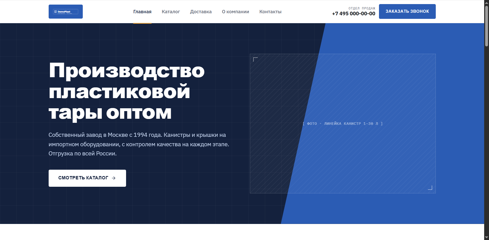
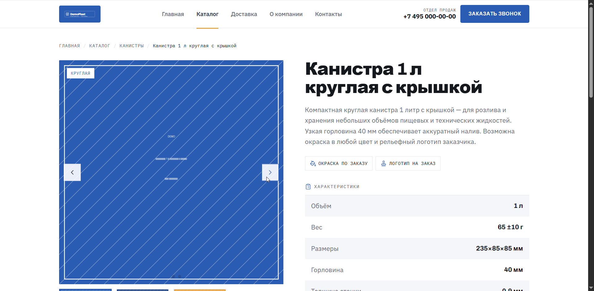
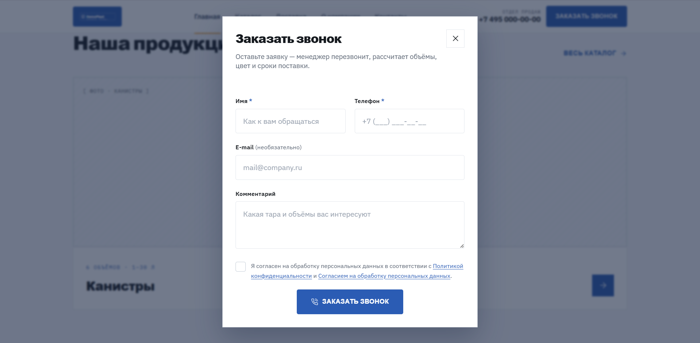
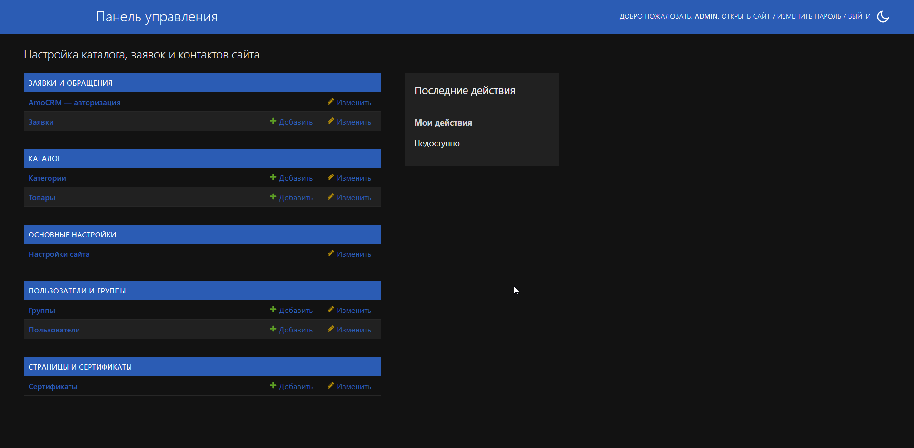

<div align="center">

# 🏭 DemoPlast — лендинг производителя с лидогенерацией

**Production-ready сайт-каталог производителя пластиковой тары на Django 5.**
SSR-каталог, формы заявок на HTMX, фоновые интеграции (email · Telegram · amoCRM),
требования 152-ФЗ, Docker + Traefik + CI/CD.

[](https://demo.135.106.161.48.nip.io)


**🌐 Живое демо: [demo.135.106.161.48.nip.io](https://demo.135.106.161.48.nip.io)** ·
📚 [Документация](docs/index.md)

</div>

---

> **Что это.** Обезличенная витрина реального коммерческого проекта. Данные заказчика
> заменены вымышленной компанией **«ДемоПласт»**; репозиторий показывает архитектуру и
> инженерные решения, не раскрывая клиента. Поднимается одной командой с самонаполняющимся
> демо, а боевая версия живёт на VPS за Traefik с автоматическим деплоем из CI.

---

## 📸 Скриншоты

| Главная | Карточка товара |
|---|---|
|  |  |

| Форма заявки | Админ-панель |
|---|---|
|  |  |

---

## 🚀 Запуск одной командой

Нужен только Docker. Из корня репозитория:

```bash
cp .env.example .env
docker compose up --build
```

Откройте **http://localhost:8000** — готово. Образ собирается, Tailwind компилируется,
БД поднимается, и контейнер сам себя наполняет демо-данными. Никаких ручных шагов.

Что происходит при старте:

1. ждёт PostgreSQL, применяет миграции и `collectstatic` (`entrypoint.sh`);
2. **сид-миграции** заливают каталог (2 категории, 9 товаров со спеками) и `SiteSettings`;
3. `tailwind build` собирает дизайн-систему;
4. `seed_demo_images` рисует плейсхолдер-картинки товаров — по 3 ракурса, чтобы карусель
   на карточке была рабочей;
5. `seed_demo_leads` создаёт фейковые заявки, чтобы админка не была пустой;
6. поднимается dev-сервер на `:8000`.

```bash
# Доступ в админку:
docker compose exec web python manage.py createsuperuser
# затем http://localhost:8000/admin/
```

> **Демо-данные генерируются, а не коммитятся.** Каталог и контакты — из сид-миграций;
> картинки и заявки создают management-команды при старте. Папка `media/` в `.gitignore` —
> репозиторий чистый, демо наполняет себя само.

> **Демо-режим.** В `.env.example` стоит `DEMO_MODE=True`: внешние интеграции (SMTP,
> Telegram, amoCRM) **не вызываются** — заявка сохраняется в БД, каналы лишь пишут в лог
> `demo, skipped`. Демо работает без единого реального ключа. Для боевого — `DEMO_MODE=False`
> и настоящие креды в `.env`.

---

## 🧱 Стек и обоснования

| Технология | Почему так |
|---|---|
| **Django 5 (монолит)** | Шесть страниц и формы не требуют микросервисов. SSR ради SEO — поисковик видит готовый HTML. Не SPA. ([ADR-0001](docs/adr/0001-monolith-not-microservices.md), [ADR-0003](docs/adr/0003-ssr-not-spa.md)) |
| **PostgreSQL 16** | Основное хранилище; заодно ORM-брокер очереди задач — без отдельного Redis. |
| **HTMX** | Интерактив форм (отправка, ошибки, лимит) без тяжёлого JS-фреймворка — сервер отдаёт HTML-фрагменты. |
| **Tailwind v4** (`django-tailwind` + standalone-бинарь) | Дизайн-система **собирается**, а не тянется с CDN. Без Node на проде. ([ADR-0004](docs/adr/0004-tailwind-compiled-not-cdn.md)) |
| **django-q2** | Фоновые задачи (уведомления, пуш в CRM) на ORM-брокере. Без Redis/Celery. |
| **django-solo** | Синглтон `SiteSettings` — контакты и реквизиты правятся в админке без кода. |
| **Sentry** | Мониторинг ошибок в проде, со встроенным **скруббером ПДн** (`config/sentry.py`). |
| **uv** | Быстрый менеджер зависимостей и venv; `uv.lock` фиксирует сборку. |
| **Docker · Traefik · GitHub Actions** | Воспроизводимое окружение; reverse-proxy с авто-TLS; CI собирает образ → GHCR → деплой по SSH. |

---

## ⚙️ Инженерные решения

Самое интересное — не вёрстка, а то, как устроены формы, интеграции и соответствие закону.

### 1. Лид сначала в БД, потом в CRM
Заявка пишется в локальную БД **первой** — это source of truth. Пуш в amoCRM идёт **после**,
асинхронно. Падение CRM или протухший OAuth-токен **не теряет заявку и не ломает форму** —
пользователь всегда получает «спасибо». ([ADR-0005](docs/adr/0005-write-lead-to-db-first.md),
[`apps/leads/views.py`](apps/leads/views.py), [`apps/leads/tasks.py`](apps/leads/tasks.py))

### 2. Фоновые задачи и устойчивость (django-q2)
Уведомления — **веер из трёх независимых каналов** (email / Telegram / amoCRM). Каждый
изолирован: падение одного не мешает остальным. Ретраи нативным механизмом django-q2.
Каналы включаются флагами в админке — выключенный даже не ставится в очередь.
([`apps/leads/services/`](apps/leads/services/))

### 3. Соответствие 152-ФЗ
- **Два отдельных документа**: «Политика конфиденциальности» и «Согласие на обработку ПДн»
  (закон запрещает зашивать согласие в политику).
- **Чекбокс согласия не предзаполнен**, валидируется **на бэкенде**; факт согласия
  фиксируется (`consent=True` + timestamp).
- **Локализация и минимизация**: хранение в РФ, аналитика не грузится до cookie-согласия
  (решение принимается на сервере в шаблоне), собираем только имя + телефон.
- **ПДн не утекают в Sentry**: `before_send`-скруббер вырезает имена/телефоны/тело форм
  из событий до отправки. ([ADR-0006](docs/adr/0006-language-policy.md),
  [объяснение](docs/explanation/compliance-152fz.md))

### 4. Безопасность форм
Honeypot-поле + `django-ratelimit` (5 заявок/час с IP, честный `429`, который HTMX корректно
свапает), CSRF на всех формах, в проде — `SECURE_SSL_REDIRECT`, HSTS, `*_COOKIE_SECURE`.

### 5. Mobile-first
Вёрстка от мобильного к десктопу через брейкпоинты Tailwind: бургер-меню, адаптивная сетка
каталога 1 → 2 → 3 колонки, тач-зоны ≥ 44px, кликабельные `tel:`-ссылки.

### 6. DEMO_MODE
Один флаг отсекает все внешние вызовы — публичное демо поднимается без реальных ключей,
при этом весь путь «форма → валидация → лид в БД» работает по-настоящему.

---

## 📚 Документация

Полная техническая документация по модели **[Diátaxis](https://diataxis.fr/)** (уроки ·
инструкции · справочник · объяснения) + **6 ADR** с обоснованием ключевых решений.
Собирается в статический сайт через MkDocs Material и **автопубликуется на GitHub Pages**
из CI при каждом push в `main`.

**🌐 Онлайн: [skerter.github.io/django-plastic-landing](https://skerter.github.io/django-plastic-landing/)**

Локально:

```bash
uv run --extra docs mkdocs serve     # http://127.0.0.1:8000
```

Точка входа — [`docs/index.md`](docs/index.md). Внутри: [getting started](docs/tutorials/getting-started.md),
[деплой](docs/how-to/deploy.md) и [эксплуатация](docs/how-to/operations.md),
[архитектура](docs/explanation/architecture.md), [модель данных](docs/reference/data-model.md),
[переменные окружения](docs/reference/environment.md), [ADR](docs/adr/README.md).

---

## 🧪 Тесты

```bash
uv sync --extra dev
uv run pytest tests/ -v        # 36 тестов
```

Покрыто: валидация и сохранение лид-формы, устойчивость каналов уведомлений, диспетчер
задач, сервисы email/Telegram/amoCRM (с моками), вьюхи каталога, `SiteSettings` и аналитика
по cookie-согласию, скруббер ПДн для Sentry.

---

## ☁️ Прод-инфраструктура

Боевая версия живёт на **Selectel VDS** (Ubuntu) за **общим Traefik**, который сам выдаёт и
продлевает TLS Let's Encrypt — без certbot. Деплой-стек — в
[`deploy/selectel/`](deploy/selectel/): сервисы `web` (Django + gunicorn), `db` (PostgreSQL),
`media` (nginx только для `/media/`). Статика — WhiteNoise внутри `web`.

**CI/CD** ([`.github/workflows/deploy.yaml`](.github/workflows/deploy.yaml)): push в `main`
→ сборка образа → пуш в **GHCR** (`ghcr.io/skerter/django-plastic-landing`) → деплой по SSH
на VPS (`pull` + `up -d`). Секреты (SSH-ключ, GHCR-токен) — в GitHub Secrets.

Подробные рунбуки: [деплой](docs/how-to/deploy.md) · [эксплуатация](docs/how-to/operations.md).

---

## 🗂️ Структура

```
django-plastic-landing/
├── compose.yaml              # локальное демо: web + db (одна команда)
├── Dockerfile                # одностадийный; Tailwind собирается на build
├── entrypoint.sh             # ждёт БД, migrate + collectstatic
├── pyproject.toml · uv.lock  # зависимости (uv)
├── .env.example              # шаблон локального окружения (DEMO_MODE=True)
├── config/
│   ├── settings/             # base · dev · docker · prod
│   ├── sentry.py             # before_send-скруббер ПДн
│   └── urls.py · wsgi.py
├── apps/
│   ├── catalog/              # Category, Product, ProductSpec, ProductImage
│   ├── leads/                # Lead, формы, services/ (mail · telegram · amocrm), tasks
│   ├── pages/                # статические страницы, Certificate, SEO
│   └── core/                 # SiteSettings (solo), context processor, sitemap, cookies
├── templates/                # base + partials + страницы (Django templates + HTMX)
├── theme/                    # django-tailwind: @theme + компонентная CSS
├── static/                   # css/demoplast.css · js/site.js · js/htmx.min.js · img/
├── scripts/                  # утилиты: скриншоты, подготовка фото и сертификатов
├── deploy/selectel/          # прод-стек: compose.yaml · nginx-media.conf · .env.example
├── docs/                     # Diátaxis-документация + ADR + скриншоты
└── tests/                    # pytest: catalog · core · leads · pages · sentry (36 тестов)
```

---

## 📄 Лицензия

[MIT](LICENSE).
