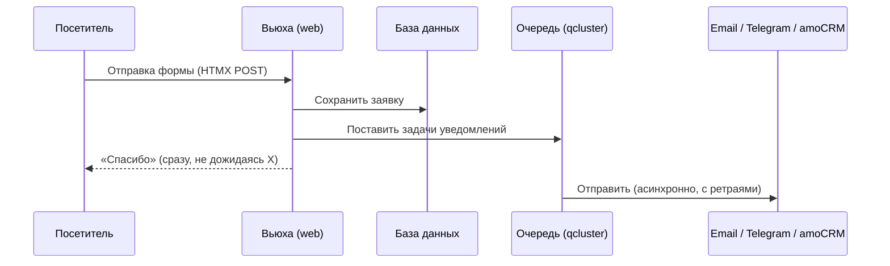

# Архитектура

Этот раздел объясняет, как устроен проект и **почему** он устроен именно так.
Если нужно что-то сделать — смотрите [инструкции](../how-to/deploy.md);
здесь — картина целиком и логика решений.

## Что это за приложение

Сайт-каталог с лидогенерацией: посетитель смотрит товары и оставляет заявку
(звонок или заказ). Это **не интернет-магазин** — нет корзины, оплаты, цен,
личного кабинета. Цель каждой страницы — привести к заявке.

Аудитория — российский B2B-рынок, поэтому два требования стоят выше прочих:
**SEO** (сайт должны хорошо индексировать поисковики) и **соответствие
152-ФЗ** (закон о персональных данных). Оба сильно повлияли на архитектуру —
см. [Соответствие 152-ФЗ](compliance-152fz.md).

## Монолит на Django

Приложение — единый Django-проект с серверным рендерингом (HTML собирается
на сервере из шаблонов), а не SPA и не набор микросервисов. Интерактив форм
сделан на HTMX — точечные запросы без тяжёлого фронтенда.

Почему так — три отдельных решения, каждое со своим разбором:

- [ADR 0001 — Монолит, не микросервисы](../adr/0001-monolith-not-microservices.md)
- [ADR 0002 — docker-compose, не Kubernetes](../adr/0002-compose-not-k8s.md)
- [ADR 0003 — Серверный рендеринг, не SPA](../adr/0003-ssr-not-spa.md)

Коротко: проект небольшой (несколько страниц + формы), а SEO критичен.
Монолит с SSR проще, дешевле в эксплуатации и лучше индексируется. Усложнение
нечем оправдать.

## Приложения и слои

Код разделён на четыре Django-приложения по зонам ответственности:

| Приложение | Отвечает за |
|---|---|
| `apps.catalog` | Категории, товары, характеристики, фото; sitemap |
| `apps.leads` | Заявки, форма, интеграции (email/Telegram/amoCRM) |
| `apps.pages` | Статические страницы, сертификаты, robots.txt |
| `apps.core` | Настройки сайта (singleton), cookie-consent, context processor |

Внутри действует принцип **тонкие вьюхи, толстые модели, логика — в сервисном
слое**. Бизнес-логика интеграций изолирована в `apps/leads/services/`
(`mail.py`, `telegram.py`, `amocrm.py`), а не размазана по вьюхам. Вьюха
заявки ([`apps/leads/views.py`](https://github.com/Skerter/django-plastic-landing/blob/main/apps/leads/views.py))
только валидирует форму, сохраняет заявку и ставит задачи в очередь — вся
работа с внешними API живёт в сервисах.

Это даёт тестируемость (сервис мокается отдельно от HTTP) и то, что вьюха не
зависит от деталей конкретной CRM.

## Поток обработки заявки

Самая важная логика проекта — как обрабатывается заявка. Ключевой принцип:
**заявка сначала пишется в свою БД, и только потом уходит во внешние системы**
([ADR 0005](../adr/0005-write-lead-to-db-first.md)).

Почему именно так:

- **Заявка не теряется.** БД — источник истины. Даже если все внешние каналы
  упадут, заявка уже сохранена и видна в админке.
- **Форма не ждёт внешние сервисы.** Ответ «спасибо» отдаётся сразу; рассылка
  идёт в фоне (`qcluster`). Пользователь не висит, пока amoCRM думает.
- **Сбой одного канала не ломает остальные.** Каждый канал — независимая
  задача; падение изолировано и ретраится. Подробнее о настройке —
  [Каналы уведомлений](../how-to/enable-notification-channels.md).

## Конфигурация без кода

Контакты, реквизиты, тексты и параметры уведомлений редактируются в админке,
а не в коде. За это отвечает singleton `SiteSettings` (одна запись в БД),
который прокидывается во все шаблоны через context processor
([`apps/core/context_processors.py`](https://github.com/Skerter/django-plastic-landing/blob/main/apps/core/context_processors.py)).
Так заказчик меняет телефон или адрес без участия разработчика. Полный состав
полей — [Модель данных](../reference/data-model.md).

## SEO

SEO заложено в нескольких местах:

- **Серверный рендеринг** — поисковик видит готовый HTML (см. ADR 0003).
- **`sitemap.xml`** генерируется из активных категорий и товаров
  (`apps/catalog/sitemaps.py`).
- **Мета-теги** берутся из полей моделей (`meta_title`, `meta_description`).
- **Мобильная вёрстка** (mobile-first) — у поисковиков mobile-first индексация.

## Настройки по окружениям

Настройки Django разделены на файлы под разные окружения, наследующие общую
базу:

| Файл | Окружение |
|---|---|
| `config/settings/base.py` | Общее для всех |
| `config/settings/dev.py` | Локальная разработка (SQLite, письма в консоль) |
| `config/settings/docker.py` | Разработка в Docker (Postgres по хосту `db`) |
| `config/settings/prod.py` | Прод (Postgres, security-флаги, Sentry, SMTP) |

Какие переменные читает каждое окружение — [Переменные окружения](../reference/environment.md).

## Прод и деплой

В продакшене — один VPS, Docker Compose, два стека (приложение + Traefik как
reverse-proxy с авто-TLS). Образ собирается в CI и тянется на сервер.
Устройство прода со схемой и пошаговым развёртыванием —
[Деплой](../how-to/deploy.md).
