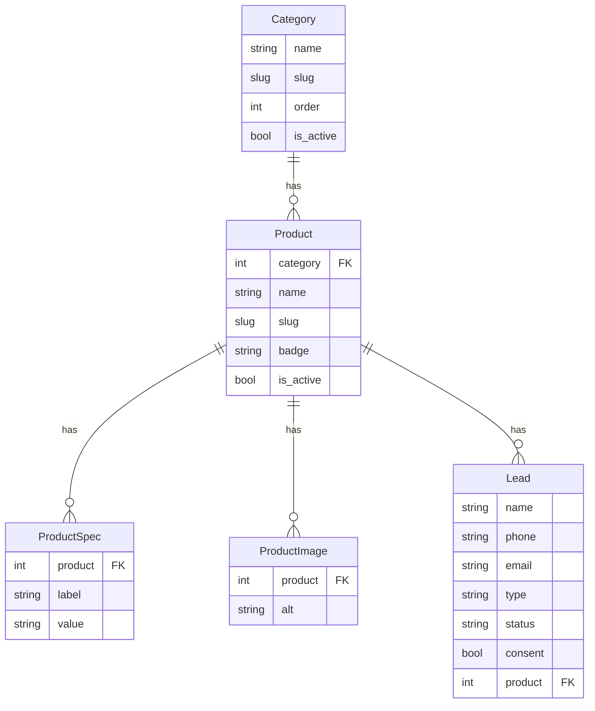

# Модель данных

Справочник по всем моделям базы данных (словарь данных). Источник —
`models.py` приложений `catalog`, `leads`, `pages`, `core`.

В колонке **Поле** — имя в коде/БД. Поля с `blank` могут быть пустыми в форме;
поля с `null` могут быть `NULL` в БД.

## Схема связей

`SiteSettings`, `AmoCRMAuth`, `Certificate` и `Page` ни с чем не связаны
(одиночки и независимые галереи) — на схеме не показаны.

---

## Каталог (`apps.catalog`)

### Category — категория каталога

| Поле | Тип | Пусто? | Описание |
|---|---|---|---|
| `name` | CharField(200) | нет | Название. |
| `slug` | SlugField | нет, уникальный | Часть URL. |
| `image` | ImageField | blank | Картинка раздела (`categories/`). |
| `order` | PositiveInteger | default 0 | Порядок сортировки. |
| `is_active` | Boolean | default True | Показывать на сайте. |

Сортировка по умолчанию: `order`, затем `name`.

### Product — товар

| Поле | Тип | Пусто? | Описание |
|---|---|---|---|
| `category` | FK → Category | нет | Категория. При удалении категории — **PROTECT** (нельзя удалить, пока есть товары). |
| `name` | CharField(200) | нет | Название. |
| `slug` | SlugField | нет, уникальный | Часть URL. |
| `badge` | CharField(50) | blank | Метка-ярлык на фото («Евроканистра»). |
| `description` | TextField | blank | Описание. |
| `image` | ImageField | blank | Главное фото (`products/`). |
| `is_active` | Boolean | default True | Показывать на сайте. |
| `order` | PositiveInteger | default 0 | Порядок. |
| `meta_title` | CharField(200) | blank | SEO-заголовок. |
| `meta_description` | CharField(300) | blank | SEO-описание. |

### ProductSpec — характеристика товара

Пары «параметр → значение». Набор у разных товаров разный (поэтому свободные
поля, а не фиксированные колонки).

| Поле | Тип | Пусто? | Описание |
|---|---|---|---|
| `product` | FK → Product | нет | Товар. При удалении товара — **CASCADE**. |
| `label` | CharField(100) | нет | Параметр («Объём»). |
| `value` | CharField(200) | нет | Значение («20»). |
| `unit` | CharField(50) | blank | Единица («л»). |
| `order` | PositiveInteger | default 0 | Порядок. |

### ProductImage — фото товара

| Поле | Тип | Пусто? | Описание |
|---|---|---|---|
| `product` | FK → Product | нет | Товар. **CASCADE**. |
| `image` | ImageField | нет | Файл (`products/`). |
| `alt` | CharField(200) | blank | Подпись/ракурс. Используется как alt и подпись миниатюры. |
| `order` | PositiveInteger | default 0 | Порядок в галерее. |

---

## Заявки (`apps.leads`)

### Lead — заявка с сайта

| Поле | Тип | Пусто? | Описание |
|---|---|---|---|
| `name` | CharField(200) | нет | Имя. |
| `phone` | CharField(20) | нет | Телефон. |
| `email` | EmailField | blank | E-mail. |
| `comment` | TextField | blank | Комментарий. |
| `type` | CharField, choices | default `order` | Тип: `callback` (звонок) / `order` (заказ). |
| `status` | CharField, choices | default `new` | Статус: `new` / `processed`. |
| `consent` | Boolean | нет | Факт согласия на обработку ПДн. |
| `created_at` | DateTime | auto | Дата создания (ставится автоматически). |
| `product` | FK → Product | null, blank | Товар, по которому заявка. При удалении товара — **SET_NULL**. |

Сортировка по умолчанию: `created_at` по убыванию (новые сверху).
Метод `as_message()` форматирует заявку в текст для уведомлений.

### AmoCRMAuth — токены amoCRM (одиночка)

Хранит OAuth-токены интеграции. Единственная запись.

| Поле | Тип | Описание |
|---|---|---|
| `access_token` | TextField | Токен доступа. |
| `refresh_token` | TextField | Токен обновления. |
| `expires_at` | DateTime | Срок действия access-токена. |

Токены создаются командой `amocrm_auth` и обновляются автоматически. В админке
доступны только для чтения.

---

## Страницы (`apps.pages`)

### Certificate — сертификат

Независимая галерея картинок на странице «О компании».

| Поле | Тип | Пусто? | Описание |
|---|---|---|---|
| `title` | CharField(200) | нет | Название. |
| `image` | ImageField | нет | Скан/фото (`certificates/`). |
| `order` | PositiveInteger | default 0 | Порядок. |
| `is_active` | Boolean | default True | Показывать. |

---

## Настройки сайта (`apps.core`)

### SiteSettings — настройки сайта (одиночка)

Единственная запись, правится в админке. Контакты, реквизиты и параметры
уведомлений. Полное описание каждого поля — в его `help_text` в админке.

**Контакты:** `company_name`, `phone_sales`, `phone_sales_person`,
`email_sales`, `phone_production`, `phone_production_person`,
`phone_accounting`, `email_accounting`.

**Адрес и режим:** `address`, `work_hours`, `work_hours_weekend`, `map_query`.

**Реквизиты:** `legal_address`, `inn`, `kpp`, `ogrn`, `okpo`, `account`,
`bank`, `bik`, `corr_account`.

**Уведомления и аналитика:** `metrika_id`, `notify_email_enabled`,
`email_notifications`, `notify_telegram_enabled`, `telegram_chat_id`,
`notify_amocrm_enabled`.

!!! note "Телефоны: одно поле — два применения"
    Телефон хранится в одном поле в виде для показа (`+7 495 000-00-00`).
    Кликабельная ссылка `tel:` вычисляется автоматически свойствами
    `phone_*_tel` — отдельно её хранить не нужно, display и href не разойдутся.

Зачем отдельные `email_sales` и `email_notifications` — см.
[Каналы уведомлений](../how-to/enable-notification-channels.md).
